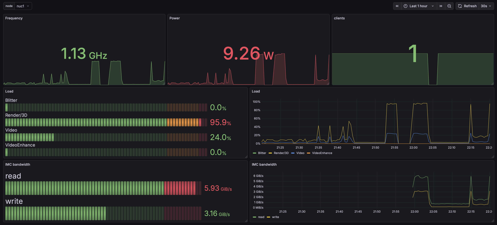

# intel-gpu-exporter
[](https://github.com/clambin/intel-gpu-exporter/releases)
[](https://app.codecov.io/gh/clambin/intel-gpu-exporter)
[](https://github.com/clambin/intel-gpu-exporter/actions)
[](https://goreportcard.com/report/github.com/clambin/intel-gpu-exporter)
[](LICENSE.md)

Exports GPU statistics for Intel Quick Sync Video GPUs.



# Installation

Container images are available on [ghcr.io](https://ghcr.io/clambin/intel-gpu-exporter).

This is how I run the container inside my Kubernetes cluster:

```
apiVersion: apps/v1
kind: DaemonSet
metadata:
  name: intel-gpu-exporter
spec:
  selector:
    matchLabels:
      app: intel-gpu-exporter
  template:
    metadata:
      labels:
        app: intel-gpu-exporter
      annotations:
        prometheus.io/scrape: "true"
        prometheus.io/port: "9100"
    spec:
      nodeSelector:
        intel.feature.node.kubernetes.io/gpu: "true"
      hostPID: true
      volumes:
        - name: dev-dri
          hostPath:
            path: /dev/dri
            type: Directory
      containers:
      - name: intel-gpu-exporter
        image: ghcr.io/clambin/intel-gpu-exporter
        args:
        - --interval=5s
        - --device=drm:/dev/dri/card0
        ports:
        - name: metrics
          containerPort: 9100
        securityContext:
          privileged: true
        volumeMounts:
          - name: dev-dri
            mountPath: /dev/dri
```

The combination of running a DaemonSet and setting the nodeSelector to `intel.feature.node.kubernetes.io/gpu="true"`
runs the exporter on every node with an Intel Quick Sync Video GPU. This does require [intel-device-plugins-for-kubernetes](https://github.com/intel/intel-device-plugins-for-kubernetes).
You may be better served by running a Deployment with a node selector for your host(s) that have an Intel Quick Sync Video GPU.

# Limitations
- Based on the [intel_gpu_top](https://gitlab.freedesktop.org/drm/igt-gpu-tools) project. Practically speaking, this means that it only supports Intel Quick Sync Video GPUs that are supported by the i915 driver.
- Developed using intel_gpu_top v2.3. The built container image packages this version.

# Metrics

| metric               | type  | labels         | help                                           |
|----------------------|-------|----------------|------------------------------------------------|
| gpumon_clients_count | GAUGE | name           | Number of active clients                       |
| gpumon_engine_usage  | GAUGE | attrib, engine | Usage statistics for the different GPU engines |
| gpumon_frequency     | GAUGE | type           | GPU frequency (requested/actual) in MHz/s      |
| gpumon_imc_read      | GAUGE |                | IMC read operations, in MiB/s                  |               
| gpumon_imc_write     | GAUGE |                | IMC write operations, in MiB/s                 |
| gpumon_power         | GAUGE | type           | Power consumption by type                      |

# Dashboard

See [dashboards.yaml](assets/dashboard/dashboards.yaml) for a Grafana dashboard visualizing these metrics.
This dashboard is exported as a [grafana-operator](https://github.com/grafana/grafana-operator) dashboard.

## Authors

* **Christophe Lambin**

## License

This project is licensed under the [MIT license](LICENSE.md).
